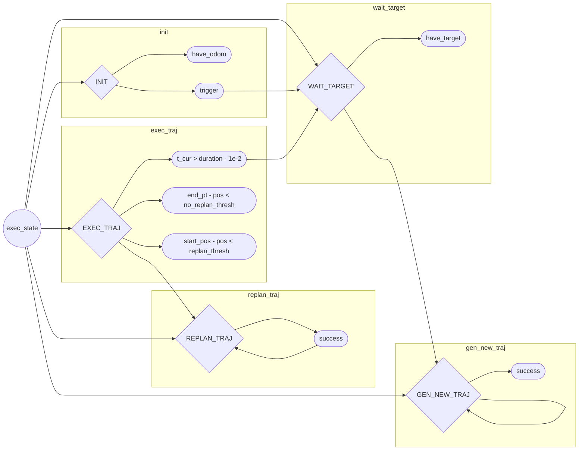
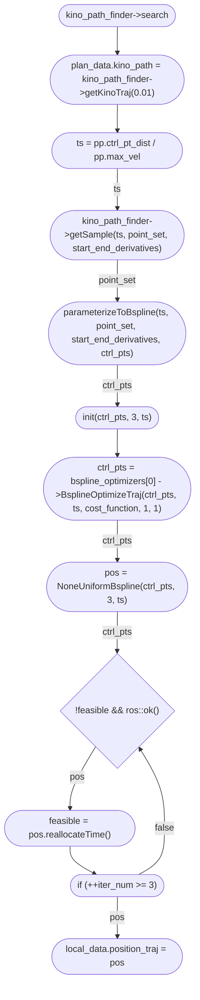

```mermaid
flowchart LR
    id1((exec_state)) --> id2{INIT}
    id1 --> id3{WAIT_TARGET}
    id1 --> id4{GEN_NEW_TRAJ}
    id1 --> id5{EXEC_TRAJ}
    id1 --> id6{REPLAN_TRAJ}
    subgraph replan_traj
        id6 --> id14([success])
    end
    subgraph exec_traj
        id5 --> id11([t_cur > duration - 1e-2])
        id5 --> id12([end_pt - pos < no_replan_thresh])
        id5 --> id13([start_pos - pos < replan_thresh])
    end
    subgraph gen_new_traj
        id4 --> id10([success])
    end
    subgraph wait_target
        id3 --> id9([have_target])
    end
    subgraph init
        id2 --> id7([have_odom])
        id2 --> id8([trigger])
    end
    id8 --> id3
    id3 --> id4
    id4 --> id4
    id5 --> id6
    id11 --> id3
    id14 --> id6
```

```mermaid
flowchart TD
    id1(["kino_path_finder->search"]) --> id2(["plan_data.kino_path = kino_path_finder->getKinoTraj(0.01)"])
    id2 --> id3(["ts = pp.ctrl_pt_dist / pp.max_vel"])
    id3 --> |ts| id4(["kino_path_finder->getSample(ts, point_set, start_end_derivatives)"])
    id4 --> |point_set| id5(["parameterizeToBspline(ts, point_set, start_end_derivatives, ctrl_pts)"])
    id5 --> |ctrl_pts| id6(["init(ctrl_pts, 3, ts)"])
    id6 --> id7(["ctrl_pts = bspline_optimizers[0] - >BsplineOptimizeTraj(ctrl_pts, ts, cost_function, 1, 1)"])
    id7 --> |ctrl_pts| id8(["pos = NoneUniformBspline(ctrl_pts, 3, ts)"])
    id8 --> |ctrl_pts| id9{"!feasible && ros::ok()"}
    id9 --> |pos| id10(["feasible = pos.reallocateTime()"])
    id10 --> id11(["if (++iter_num >= 3) "])
    id11 --> |false| id9
    id11 --> |pos| id12(["local_data.position_traj = pos"])
```
