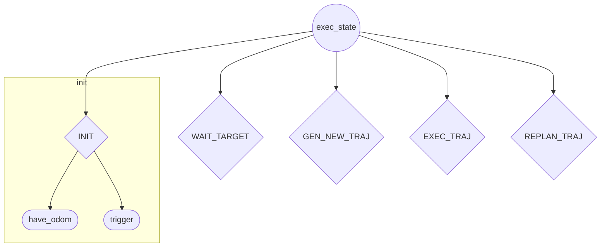
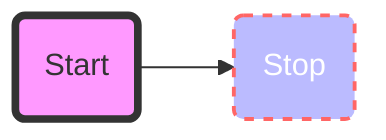

```mermaid
flowchart TB
    id1((exec_state)) --> id2{INIT}
    id1 --> id3{WAIT_TARGET}
    id1 --> id4{GEN_NEW_TRAJ}
    id1 --> id5{EXEC_TRAJ}
    id1 --> id6{REPLAN_TRAJ}
    subgraph init
        id2 --> id7([have_odom])
        id2 --> id8([trigger])
    end
```
    

```mermaid
flowchart LR
    id1(Start)-->id2(Stop)
    style id1 fill:#f9f,stroke:#333,stroke-width:4px
    style id2 fill:#bbf,stroke:#f66,stroke-width:2px,color:#fff,stroke-dasharray: 5 5
```
    
