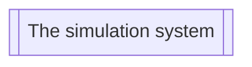
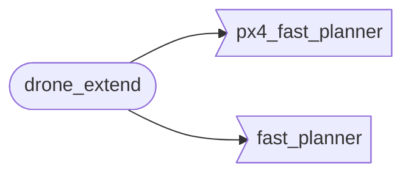
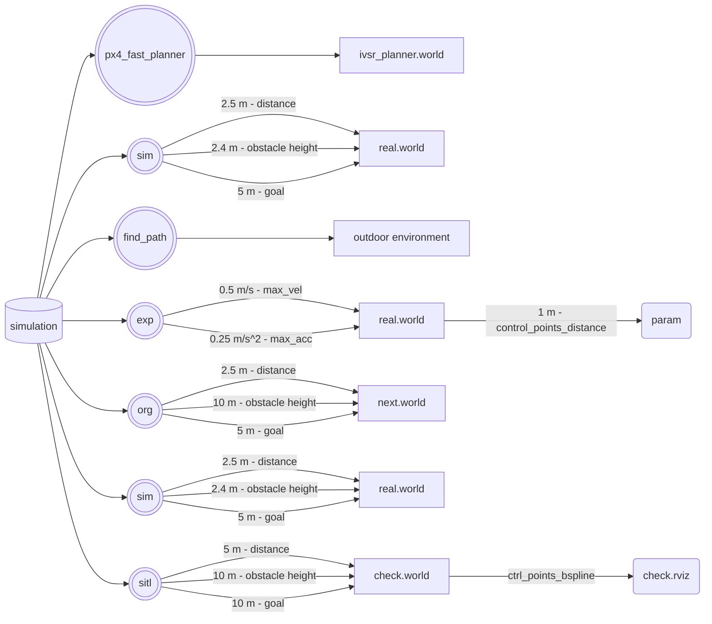
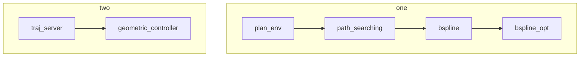
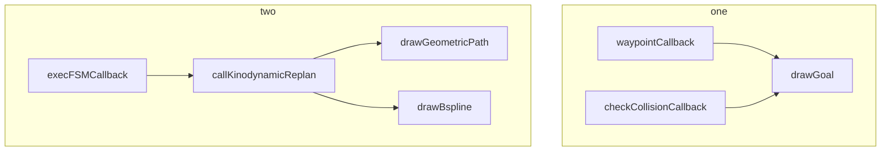

```mermaid
flowchart TD
    id1[[The simulation system]]
```    

```mermaid
flowchart LR
  id1([drone_extend]) --> id2>px4_fast_planner]
  id1 --> id3>fast_planner]
```

```mermaid
flowchart LR 

id1[(simulation)] --> id2(((px4_fast_planner)))
id2 --> id3[ivsr_planner.world]
id1 --> id4(((sim)))
id4 -->|2.5 m - distance| id5[real.world]
id4 -->|2.4 m - obstacle height| id5
id4 -->|5 m - goal| id5
id1 --> id6(((find_path)))
id6 --> id7[outdoor environment]
id1 --> id8(((exp)))
id8 -->|0.5 m/s - max_vel| id9[real.world]
id8 -->|0.25 m/s^2 - max_acc| id9
id9 -->|1 m - control_points_distance| id10(param)
id1 --> id11(((org)))
id11 -->|2.5 m - distance| id12[next.world]
id11 -->|10 m - obstacle height| id12
id11 -->|5 m - goal| id12
id1 --> id13(((sim)))
id13 -->|2.5 m - distance| id14[real.world]
id13 -->|2.4 m - obstacle height| id14
id13 -->|5 m - goal| id14
id1 --> id15(((sitl)))
id15 -->|5 m - distance| id16[check.world]
id15 -->|10 m - obstacle height| id16
id15 -->|10 m - goal| id16
id16 -->|ctrl_points_bspline| id17(check.rviz)
```

```mermaid
flowchart TB
  subgraph one
    plan_env --> path_searching;
    path_searching --> bspline;
    bspline --> bspline_opt;
  end
  subgraph two
    traj_server --> geometric_controller;
  end
```

```mermaid
flowchart TB
  subgraph one
    waypointCallback --> drawGoal;
    checkCollisionCallback --> drawGoal;
  end
  subgraph two
    execFSMCallback --> callKinodynamicReplan;
    callKinodynamicReplan --> drawGeometricPath;
    callKinodynamicReplan --> drawBspline;
  end
```
