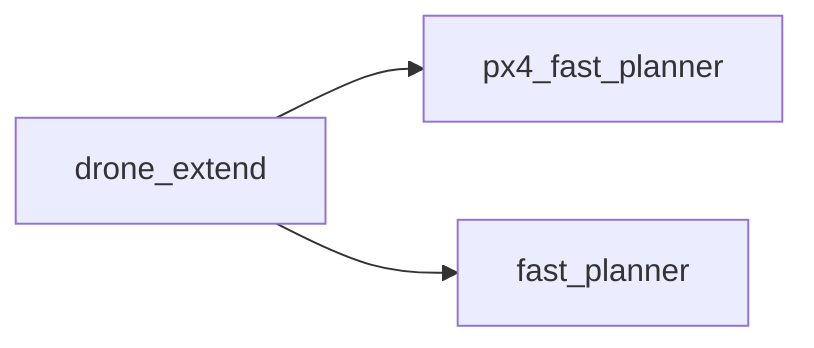
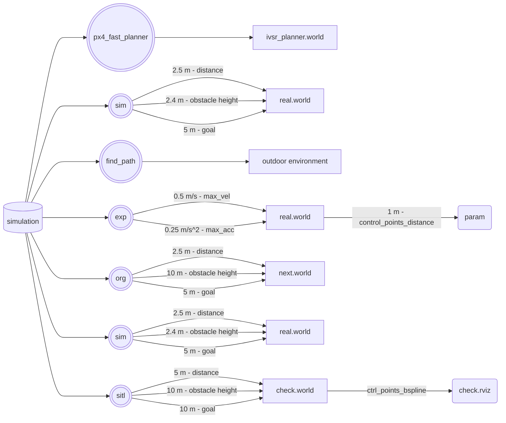
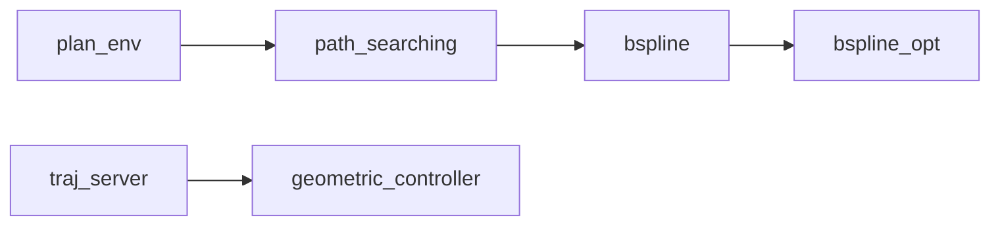
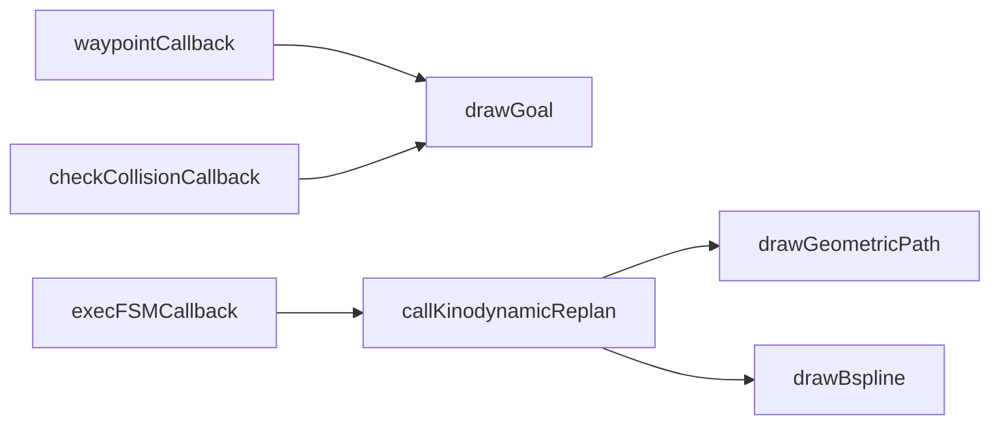

```mermaid
graph LR
  drone_extend --> px4_fast_planner;
  drone_extend --> fast_planner;
```

```mermaid
flowchart LR 

A[(simulation)] o--> B(((px4_fast_planner)))
B --> C[ivsr_planner.world]
A o--> D(((sim)))
D -->|2.5 m - distance| E[real.world]
D -->|2.4 m - obstacle height| E
D -->|5 m - goal| E
A o--> F(((find_path)))
F --> G[outdoor environment]
A o--> H(((exp)))
H -->|0.5 m/s - max_vel| I[real.world]
H -->|0.25 m/s^2 - max_acc| I
I -->|1 m - control_points_distance| II(param)
A o--> J(((org)))
J -->|2.5 m - distance| K[next.world]
J -->|10 m - obstacle height| K
J -->|5 m - goal| K
A o--> L(((sim)))
L -->|2.5 m - distance| LL[real.world]
L -->|2.4 m - obstacle height| LL
L -->|5 m - goal| LL
A o--> M(((sitl)))
M -->|5 m - distance| N[check.world]
M -->|10 m - obstacle height| N
M -->|10 m - goal| N
N -->|ctrl_points_bspline| NN(check.rviz)
```

```mermaid
graph LR
  plan_env --> path_searching;
  path_searching --> bspline;
  bspline --> bspline_opt;
  traj_server --> geometric_controller;
```

```mermaid
graph LR
  waypointCallback --> drawGoal;
  checkCollisionCallback --> drawGoal;
  execFSMCallback --> callKinodynamicReplan;
  callKinodynamicReplan --> drawGeometricPath;
  callKinodynamicReplan --> drawBspline;
```

  
