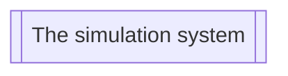
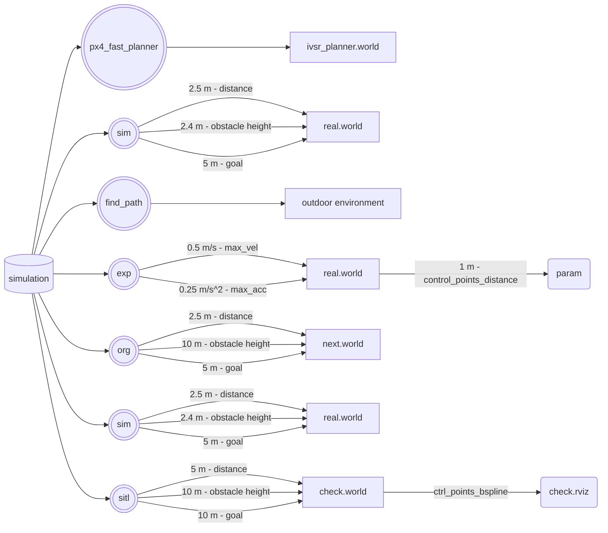
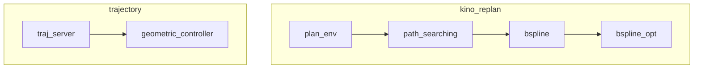
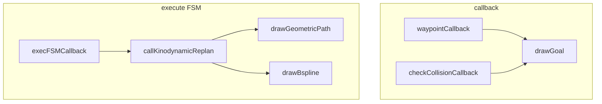
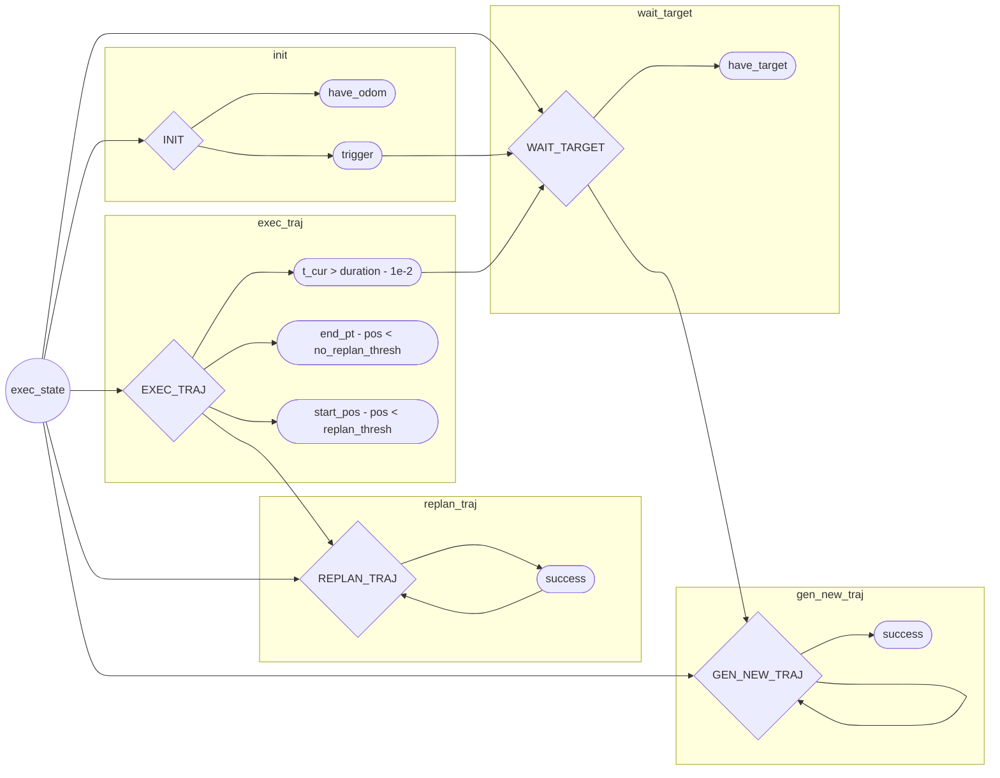
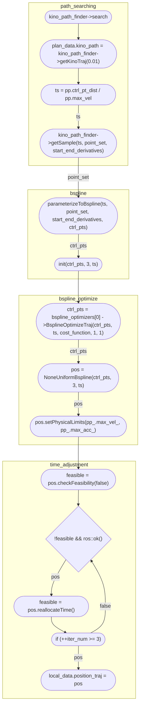

```mermaid
flowchart TD
    id1[[The simulation system]]
```    

```mermaid
flowchart LR
  id1([drone_extend]) --> id2>px4_fast_planner]
  id1 --> id3>fast_planner]
```

```mermaid
flowchart LR 

id1[(simulation)] --> id2(((px4_fast_planner)))
id2 --> id3[ivsr_planner.world]
id1 --> id4(((sim)))
id4 -->|2.5 m - distance| id5[real.world]
id4 -->|2.4 m - obstacle height| id5
id4 -->|5 m - goal| id5
id1 --> id6(((find_path)))
id6 --> id7[outdoor environment]
id1 --> id8(((exp)))
id8 -->|0.5 m/s - max_vel| id9[real.world]
id8 -->|0.25 m/s^2 - max_acc| id9
id9 -->|1 m - control_points_distance| id10(param)
id1 --> id11(((org)))
id11 -->|2.5 m - distance| id12[next.world]
id11 -->|10 m - obstacle height| id12
id11 -->|5 m - goal| id12
id1 --> id13(((sim)))
id13 -->|2.5 m - distance| id14[real.world]
id13 -->|2.4 m - obstacle height| id14
id13 -->|5 m - goal| id14
id1 --> id15(((sitl)))
id15 -->|5 m - distance| id16[check.world]
id15 -->|10 m - obstacle height| id16
id15 -->|10 m - goal| id16
id16 -->|ctrl_points_bspline| id17(check.rviz)
```

```mermaid
flowchart TB
  subgraph kino_replan
    plan_env --> path_searching;
    path_searching --> bspline;
    bspline --> bspline_opt;
  end
  subgraph trajectory
    traj_server --> geometric_controller;
  end
```

```mermaid
flowchart TB
  subgraph callback
    waypointCallback --> drawGoal;
    checkCollisionCallback --> drawGoal;
  end
  subgraph execute FSM
    execFSMCallback --> callKinodynamicReplan;
    callKinodynamicReplan --> drawGeometricPath;
    callKinodynamicReplan --> drawBspline;
  end
```

```mermaid
flowchart LR
    id1((exec_state)) --> id2{INIT}
    id1 --> id3{WAIT_TARGET}
    id1 --> id4{GEN_NEW_TRAJ}
    id1 --> id5{EXEC_TRAJ}
    id1 --> id6{REPLAN_TRAJ}
    subgraph replan_traj
        id6 --> id14([success])
    end
    subgraph exec_traj
        id5 --> id11([t_cur > duration - 1e-2])
        id5 --> id12([end_pt - pos < no_replan_thresh])
        id5 --> id13([start_pos - pos < replan_thresh])
    end
    subgraph gen_new_traj
        id4 --> id10([success])
    end
    subgraph wait_target
        id3 --> id9([have_target])
    end
    subgraph init
        id2 --> id7([have_odom])
        id2 --> id8([trigger])
    end
    id8 --> id3
    id3 --> id4
    id4 --> id4
    id5 --> id6
    id11 --> id3
    id14 --> id6
```

```mermaid
flowchart TD
    subgraph path_searching
    id1(["kino_path_finder->search"]) --> id2(["plan_data.kino_path = kino_path_finder->getKinoTraj(0.01)"])
    id2 --> id3(["ts = pp.ctrl_pt_dist / pp.max_vel"])
    id3 --> |ts| id4(["kino_path_finder->getSample(ts, point_set, start_end_derivatives)"])
    end
    subgraph bspline
    id4 --> |point_set| id5(["parameterizeToBspline(ts, point_set, start_end_derivatives, ctrl_pts)"])
    id5 --> |ctrl_pts| id6(["init(ctrl_pts, 3, ts)"])
    end 
    subgraph bspline_optimize
    id6 --> id7(["ctrl_pts = bspline_optimizers[0] - >BsplineOptimizeTraj(ctrl_pts, ts, cost_function, 1, 1)"])
    id7 --> |ctrl_pts| id8(["pos = NoneUniformBspline(ctrl_pts, 3, ts)"])
    id8 --> |pos| id9(["pos.setPhysicalLimits(pp_.max_vel_, pp_.max_acc_)"])
    end
    subgraph time_adjustment
    id9 --> id10(["feasible = pos.checkFeasibility(false)"])
    id10 --> id11{"!feasible && ros::ok()"}
    id11 --> |pos| id12(["feasible = pos.reallocateTime()"])
    id12 --> id13(["if (++iter_num >= 3) "])
    id13 --> |false| id11
    id13 --> |pos| id14(["local_data.position_traj = pos"])
    end
```
